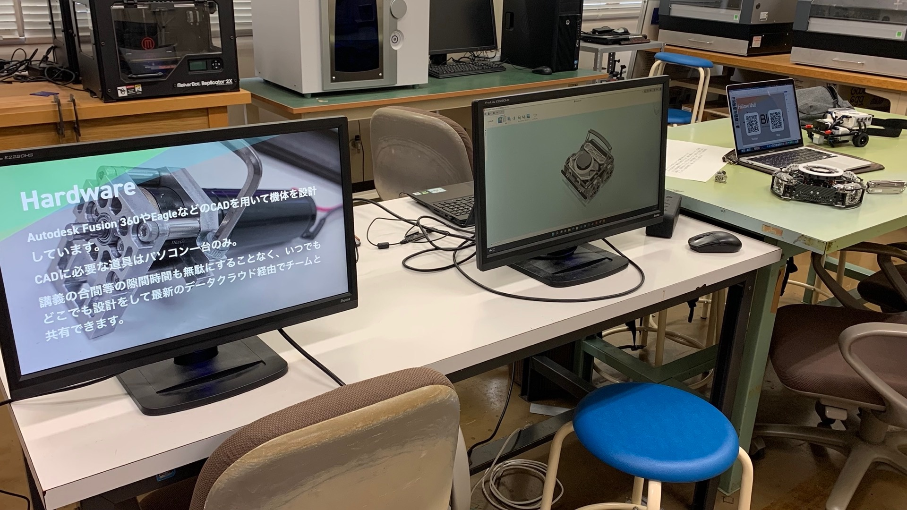

こんにちは！夏休みが始まり心がわくわくでいっぱいのしろくま＠胡瓜です。

# 岐阜高専オープンキャンパス

8/6,7に岐阜高専のオープンキャンパスがあったのですが、僕たちBlendも電子制御工学科棟一階で展示をいたしました。

電子制御工学実験室への動線だったのもあり来場した多くの方々にBlendの活動を知っていただくことができました。ありがとうございました！

# 展示内容

まだロボットが完成していないのでCADの画面を見せながらの競技の紹介と、ぽんちょの画像認識プログラムのデモ、高専や寮生活の説明などをしました。特に画像認識のデモは実際に動いているところが見えるので多くの方に興味を持って見てくださりました。

中学三年生だけでなく小学生の人も思ったより多くいらしていて、少しでも高専入学へのきっかけになれればなと思っています。

# 夏休み頑張るぞ

9月末までの夏休みの間に頑張ってハードウェアを完成させようと思います。画像処理や無線通信でのデバッガ構築なども完成させたい…！

では頑張ります。ｱｧ…ｺﾚｶﾞﾜﾀｼﾉｼｱﾜｾ…❤️