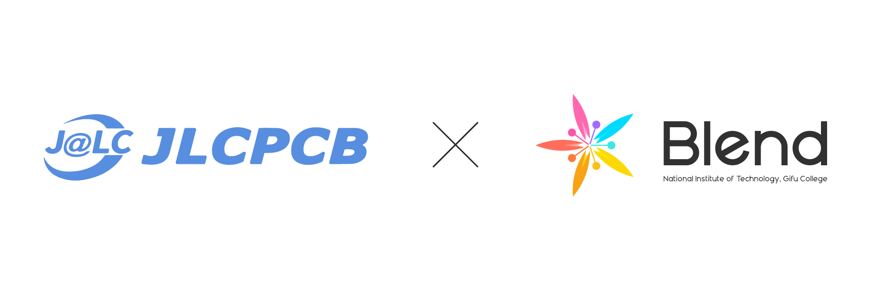
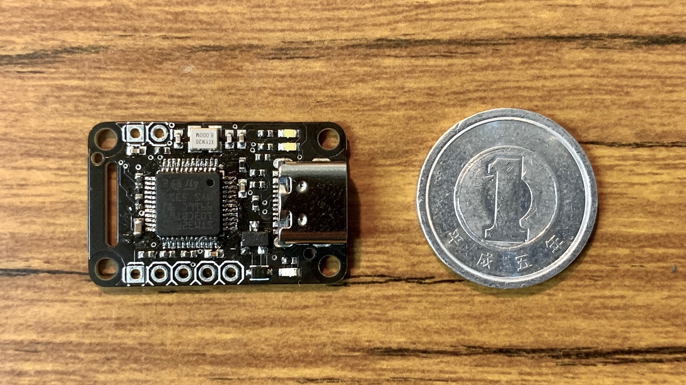

ども！しろくま＠胡瓜です。

昨日で高専は夏休みが終わり、今日から学校が始まりました。夏休み一匹狼状態だったので久しぶりに友達に会えて楽しいです。1ヶ月強も経つとみんなの髪色が結構変わっています。テスト返しなので講義も早く終わったりと嬉しいことたくさん。ゔわっ、評定と現実はみたくないんだお…

ということで今回は教室でリアルゴールドRock Energy X飲んでる白熊が記事をお届けします。久しぶりの早起き（8時20分）で脳が回らないのでカフェイン必須。

# スポンサー

プリント基板を発注したことがある人はJLCPCBっていうメーカーさんを聞いたことがある人も多いと思います。価格が安かったり、黒が艶消しだったりすることで有名ですね。

自分も普段基板を発注するときはこちらのJLCPCBを利用させてもらってたのですが、今回JLCPCBさんにBlendのスポンサーになっていただけることになりました！！😆ﾔｯﾀｰ

予算いざこざですごく困っていたのでこうやって支援していただけて本当に嬉しいです。ありがとうございます。

JLCPCBさんのホームページはこちらです👀

[PCB Prototype & PCB Fabrication Manufacturer - JLCPCB](https://jlcpcb.com/JPV)

# 早速発注してみた

善は急げということで早速発注させていただきました。小型化&USB-C化したかったST-LINKっていうSTM32マイコンの書き込み機を作りました。

コンパクトにまとまって、USB-C対応です。バッチリ動作しました👍

電源や通信確認用のLEDは青と白にしたらめっちゃカッコよくなりました。レスキューは青使えるのがいいですね。あれっ、サッカーは使えないのカナ❓

<blockquote class="twitter-tweet">
これね <a href="https://t.co/l5yk69NPa0">https://t.co/l5yk69NPa0</a> <a href="https://t.co/vmJfQKqk3v">pic.twitter.com/vmJfQKqk3v</a>
&mdash; ぽんちょ٩(ˊᗜˋ*)و Blend (@Pontyo_poor) <a href="https://twitter.com/Pontyo_poor/status/1571839521104482304?ref_src=twsrc%5Etfw">September 19, 2022</a></blockquote> 

こんな感じでカプトンテープにぺちゃっとされた状態で届きました。写真には写っていませんがクッションもりもりの包装でとてもしっかり梱包されていました。

今回は部品実装サービスもお願いしました。抵抗とか水晶振動子とかをこちらで半田しなくて良かったのはとても時間短縮になりましたし、何より手半田では難しいサイズの部品も使えるのでかなり小型化をすることができました。

ST-LINKのファームウェアはネット漁れば殻割ったり海賊版つかったりしてる人もいるっぽいですがそれは道に反するので、単純にNucleoのST-LINKを剥がしてつけました。（そこだけは手半田する必要があります。）

こちらに設計データは公開してあります。ソフトウェアはAutodesk Eagleです。ライセンスはCC BY-NC-SA 4.0でお願いします。

<a href="https://github.com/Blend-RCJJ/ST-LINK_USBC" rel="nofollow" target="_blank">GitHub</a>

<a href="https://github.com/Blend-RCJJ/ST-LINK_USBC" rel="nofollow" target="_blank">https://github.com/Blend-RCJJ/ST-LINK_USBC</a>

<a href="https://github.com/Blend-RCJJ/ST-LINK_USBC" rel="nofollow" target="_blank">GitHub - Blend-RCJJ/ST-LINK_USBC</a>

Contribute to Blend-RCJJ/ST-LINK_USBC development by creating an account on GitHub.
<a href="https://github.com/Blend-RCJJ/ST-LINK_USBC" rel="nofollow" target="_blank">

</a>

では、また進捗できたら記事書くので楽しみにしていてください！ではまた👋

