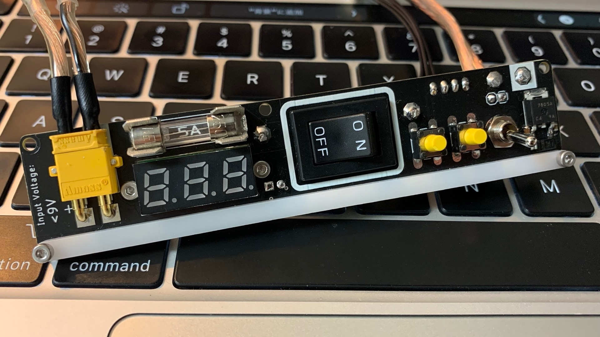

こんにちは！ハード担当のしろくま＠胡瓜（[@shirokuma89dev](https://twitter.com/shirokuma89dev)）です。

実は現在岐阜高専はテスト週間真っ只中です。試験勉強しなくていいの？と思われるかもしれませんがもちろんそう（正論）です。昨日は情報処理の試験後に机バンバンして発狂してました（）

12/18にはブロック大会があるのでそこまでにハードウェアを完成させたくて今頑張っています。テスト勉強とロボットのバランスを取るのが難しいです。しんじゃいs

前置きが長いですね。ごめんなさい。黙ります。

# スポンサーのご紹介

スポンサーになっていただいているJLCPCBさんの紹介をちょっとだけさせてください。いつも大変お世話になってます！

<a href="https://jlcpcb.com" rel="nofollow" target="_blank">https://jlcpcb.com</a>

<a href="https://jlcpcb.com" rel="nofollow" target="_blank">PCB Prototype & PCB Fabrication Manufacturer - JLCPCB</a>

China's Largest PCB Prototype Manufacturer, offers 24 hours Quick Turn PCB prototype, PCB assembly and Reliable small-batch PCB production.

Twitter:[@JLCPCB_Japan](https://twitter.com/jlcpcb_japan)

中国の会社なのですが、主に2つの特長（割と個人主観）があります。

- 黒が艶消しでかっこいい
- PCBAが最高

他の基板メーカーさんだと基板を黒色で発注した時に大抵の場合艶ありの黒になります。艶消ししようとすると別料金が必要になることが多いのですが、JLCPCBさんはデフォルトで艶消しの黒です。

これめちゃくちゃかっこいいです。初めてJLCPCBを利用した際はこれが決め手となって選びました。超おすすめ

PCBAは基板に電子部品をはんだ付けしてくれるサービスです。手半田では目が痛くなるような1005サイズのチップ抵抗や高密度実装ができるようになるのは非常にありがたいです。今までは秋月とかで電子部品を買ってきて基板に手半田してましたが、今年のBlendの基板はほぼ全ての部分でPCBAサービスを利用しました。

文字ではあんまり伝わりませんね、**では僕たちがJLCPCBの力を借りて作った基板を写真でこれから紹介していきます！！**

# #1 距離センサモジュール

ToFセンサ（VL53L0X）が12個とフルカラーLED（WS2812B）が24個乗った基板です。LED24個は非常にロマンがあります。

こんな感じで周囲の障害物の状況を高速に読み込めます。ロボットの迷路探索に使います。

<blockquote class="twitter-tweet">
距離センサーモジュールのGUI作ったぞー！！！！ <a href="https://t.co/o8a4ueaqmn">pic.twitter.com/o8a4ueaqmn</a>
&mdash; Blend☕️岐阜高専 (@Blend_GifuRCJ) <a href="https://twitter.com/Blend_GifuRCJ/status/1593662614361366528?ref_src=twsrc%5Etfw">November 18, 2022</a></blockquote> 

JLCPCBから届いた時の状態はこんな感じです。ピッチの細かいGPIOエキスパンダー（黒いゲジゲジみたいなやつ）を半田しなくていいのは助かりました。

# #2 制御基板

メインマイコンのSTM32F446REと

- ロードセル用差分増幅回路
- 無線モジュール
- フルカラーLED
- RS485変換回路
- 電圧レギュレータ
- マイコンの書き込み回路
- その他色々
  
が全てこの中に詰め込まれています！！部品も綺麗に配置できて配線も綺麗にやることができたので個人的にめちゃめちゃお気に入りです。

JLCPCBさんのロゴと一緒にBlendのロゴもいれさせてもらいました♪裏は部品がないシンプルな構成になっています。

部品実装サービスの何が良いかって、予備基板を作るコストを大幅に減らせる点です。今年はちゃんと2セット以上基板を用意して準備万端の状態にしようと思います。

# #3 電源・UI基板

黒の艶消し基板に黄色いコネクタとスイッチが映える電源・UI基板です。電源スイッチは安全管理の一環として押しやすいものにし、かつ周りに白いシルクを入れることで目立つようにしています。

この白いバーの裏には24個のLEDが載っています。こんなんなんぼあってもいいですからね〜。この密度でLEDを24個手半田するとなると本当に地獄なので部品実装サービスがあったからこそできた設計です。ぜひ全国大会では多くの人に光る姿を生で見てもらいたいなと思います。

# #4 床色認識センサ

フォトトランジスタとNeoPixelが載っているだけのシンプルな基板です。設計は僕ではなく、ぽんちょ（[@pontyo_poor](https://twitter.com/pontyo_poor)）が担当しました。ぽんちょ人生初の基板設計です。

# 終わりに

各基板の機能や設計についてはまた後日詳細記事を出そうと思います。今回の基板の回路図やPCBレイアウトはこちらのGitHubリポジトリで公開されており誰でもご覧になれます。ライセンス（CC BY-NC-SA 4.0）の範囲内であればご自由にお使いいただいて結構です。

<a href="https://github.com/Blend-RCJJ/PCB" rel="nofollow" target="_blank">GitHub</a>

<a href="https://github.com/Blend-RCJJ/PCB" rel="nofollow" target="_blank">https://github.com/Blend-RCJJ/PCB</a>

<a href="https://github.com/Blend-RCJJ/PCB" rel="nofollow" target="_blank">GitHub - Blend-RCJJ/PCB: 基盤ではなく基板をつくるよ</a>

基盤ではなく基板をつくるよ. Contribute to Blend-RCJJ/PCB development by creating an account on GitHub.

進捗はTwitter（[@Blend_GifuRCJ](https://twitter.com/Blend_GifuRCJ)）の方でガシガシ公開していますのでもしよろしければフォローしていただけると嬉しいです。

最後に今回スポンサーになっていただいたJLCPCBさんには本当に感謝しています。Blendの予算があまりない中のご支援だったので本当に助かりました。ありがとうございます！！

まとめると**部品実装サービスはいいぞ**、ということです。ではまた👋