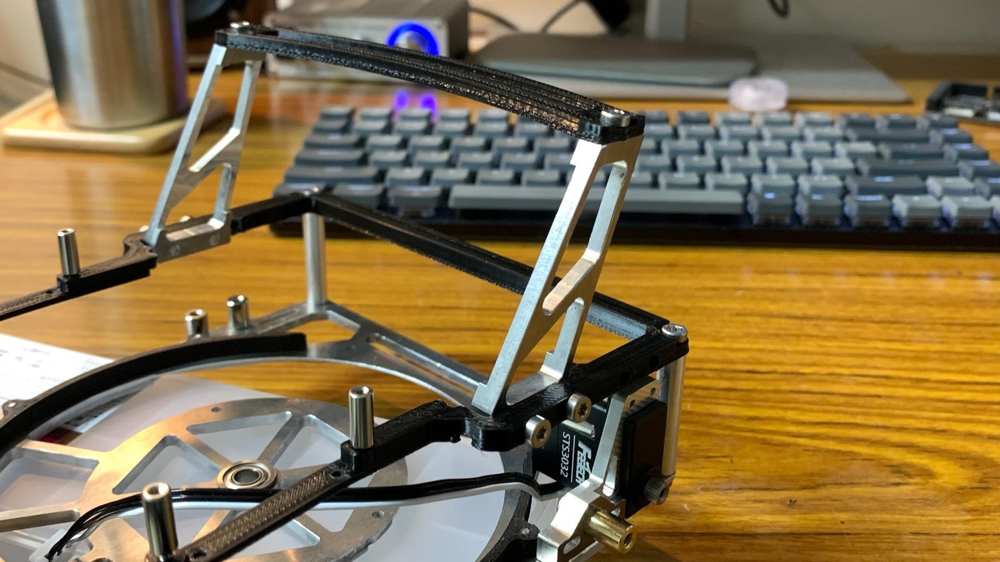
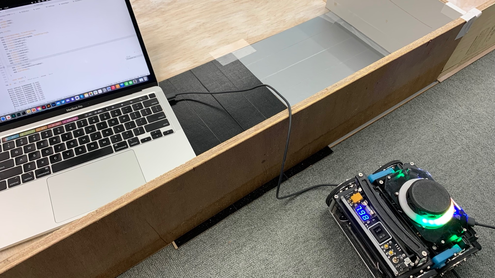
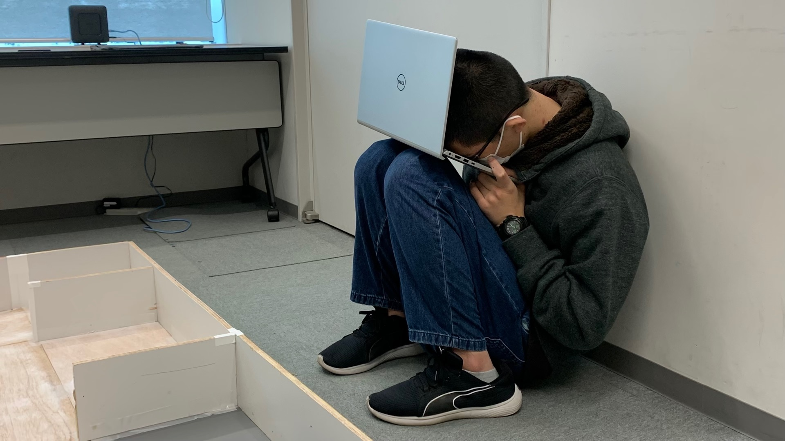

あはは！しろくま＠胡瓜です。ｼｬｷｰﾝ

~~最近僕ばっかブログ書いてますね、みんな書いてよぉ。~~

12/18に大垣市情報工房で岐阜ブロック大会が開催されました。全国大会の一歩手前の大会です。結論から言うと無事推薦を得ることができました。うれしい！全国頑張ります。

# 試合直前一週間

まだ全然ハードウェアが仕上がっていなかったので大変でした。加工したものを随時組み立てて…って感じです。探索アルゴリズムはおなぎが2日くらいで特急で書いてました。

モンスターエナジーとかで元気玉を前借りしながらの製作です。大会二日前は初めてモーターがまわり、足回りの評価をしている状態でした。

<blockquote class="twitter-tweet">
異次元の走破性能😎😎😎 <a href="https://t.co/Ukh9Kf5EIq">pic.twitter.com/Ukh9Kf5EIq</a>
&mdash; Blend☕️岐阜高専 (@Blend_GifuRCJ) <a href="https://twitter.com/Blend_GifuRCJ/status/1603087326074109952?ref_src=twsrc%5Etfw">December 14, 2022</a></blockquote> 

そして、大会前日に距離センサの制御マイコンがぶっ壊れます。Seeeduino XIAO SAMD21を使っていたのですが、連続でブートローダーが飛びました。Twitterで検索してみると電源オンオフが多い環境下での使用で同じ症状に悩まされている人が多かったので、RP2040に換装したら無事動作しました。あれからブートローダー殺人事件は発生していません。

怒涛の追い上げの末、大会前日の夜にはなんとか簡単な探索ができるようになっていました！その後朝のギリギリまで3Dプリンタで印刷して…って感じです。なんとか間に合った…

# @大会会場

試合開始ギリギリまで調整を進めました。参加チーム数が1チームだったことと、岐阜ブロック初のメイズチームでデモ的要素もあったことから開始時間を10分ほどずらしていただけました。この10分に本当に助けられました…。

第一走行はループにハマり、階段のみの5点の獲得となりました。点数こそ低いものの、試合進行の停止が1回もなかったことと、不安定な動きをしなかったことはかなり大きな成果だと思います。黒タイル回避も問題なかったです。足回り走破性能はピカイチでした。コアレスサーボ様様🙏

<blockquote class="twitter-tweet">
第一走行は被災者検出はうまくいきませんでしたが、安定した階段の走行と落とし穴回避&amp;競技進行停止0回で5点獲得しました！！！大きな一歩です。 <a href="https://t.co/EWBLkfC3aV">pic.twitter.com/EWBLkfC3aV</a>
&mdash; Blend☕️岐阜高専 (@Blend_GifuRCJ) <a href="https://twitter.com/Blend_GifuRCJ/status/1604335671979626496?ref_src=twsrc%5Etfw">December 18, 2022</a></blockquote> 

第二走行では**被災者検出に成功**しました！即興探索アルゴリズムなのでループにハマってしまい、一回競技進行停止をしましたが、原因がわかっているものなので次までにきちんと対策してこっようと思います。階段とチェックポイント到達もバッチリでした。

<blockquote class="twitter-tweet">
第二走行、被災者検出成功しました！チェックポイント到達と階段も安定クリアです💪 <a href="https://t.co/AwqDcD2mod">pic.twitter.com/AwqDcD2mod</a>
&mdash; Blend☕️岐阜高専 (@Blend_GifuRCJ) <a href="https://twitter.com/Blend_GifuRCJ/status/1604365755365015552?ref_src=twsrc%5Etfw">December 18, 2022</a></blockquote> 

# 振り返り

## よかった点

- 画像認識できた
- トルクも十分だった
- カメラとの通信は問題なかった
- ハードウェアは全く壊れなかった
- 無線デバッガがこの日初動作した

## 次に繋げたい点

- 移動速度が早すぎて認識できない被災者がいた
- 未到達なマスがあった
- ギリギリでプログラムを変えない
- ちゃんとプログラムをバックアップしておくこと
- ジャイロセンサのドリフト修正
- 自己位置推定アルゴリズムを作れ！！

 

って感じですかね。ハードウェア故障や予兆が一切なかったのは本当に素晴らしいことだと思います。

# プレゼンシート

ページの読み込み速度が遅くなるのでツイート埋め込みで。高画質版はツイッター飛んでもらって4K画像を読み込んでください。

<blockquote class="twitter-tweet">
今日の岐阜ブロックのプレゼンシートです！ <a href="https://t.co/telTNJjkqG">pic.twitter.com/telTNJjkqG</a>
&mdash; Blend☕️岐阜高専 (@Blend_GifuRCJ) <a href="https://twitter.com/Blend_GifuRCJ/status/1604261893635334144?ref_src=twsrc%5Etfw">December 17, 2022</a></blockquote> 

（多分全参加チームの中で一番プレゼンシートガチ勢だったとおもふ…笑）

# さいごに

Blendとして参加する初の公式試合でしたが、割と満足のいく結果だったと思います。しかしうまくいかなかった点が多いのも事実なので、これから全国に向けて安定性を高めていきたいと思います。

ハードウェアの変更はもうほぼしない予定で、若干外装変えるかなくらいです。僕たちのチームのプログラムはGitHubで全て管理しているので、これからは**メンバー4人全員がソフトウェア担当**となり、安定した動作と正確性に注力することとなりそうです。ギリギリでハードウェアが完成したロボットが安定して動くわけなんてないので、全国まで短いですがソフトウェア頑張ろうと思います。

**では！これからも応援よろしくお願いいたします**🙇

# おまけ

ぽんちょさんです。Blendは睡眠を疎かにしないクリーンな活動を進めています！！！！！()()()()()